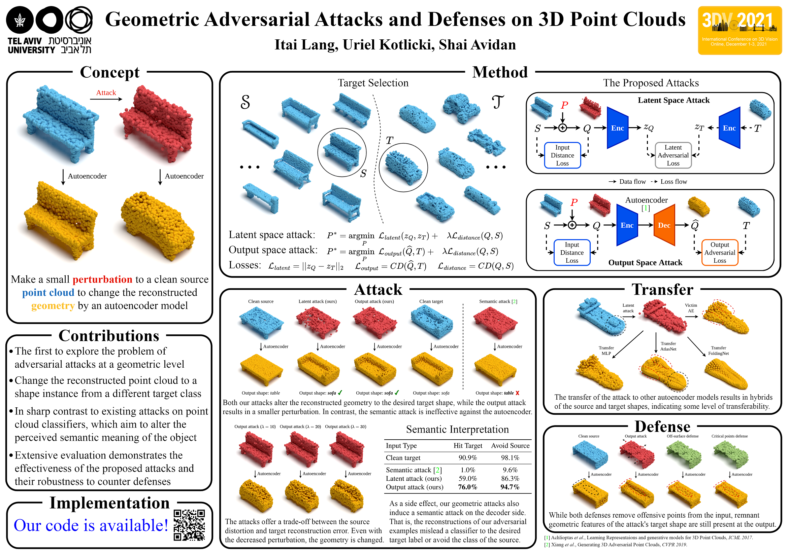

# Poster Guide

## Introduction
After a paper is accepted to a conference, you are usually required to prepare a poster to present your work. During my PhD, I have been working on a poster format that worked well for me and has also been used by colleagues and fellow students. This guide presents the poster format, along with guidelines, tips, and examples, so that others may benefit from it as well.

Before getting into details, let's ask: What is the poster's purpose? As I see it, it should draw a crowd and assist you in presenting and discussing the highlights of your work. Let's see how to do that with structure and content. We'll use the following poster as a running example:

The poster is about the work [SCOOP](https://itailang.github.io/SCOOP/). I created the poster with the [draw.io](https://www.drawio.com/) tool. The poster's source file is [here](./assets/scoop_cvpr2023_poster.drawio). You are welcome to use it as a basis for your own poster and alter it to your needs.

## Structure
The poster's top includes the following elements:
  * Left side: institution logo (or logos)
  * Right side: conference logo
  * Center: Paper title, author names, and affiliation

At the bottom, there may be references to other works mentioned on the poster.

For the poster's body, I recommend a general structure of three columns. Since the poster size is relatively large, about 2 meters in width by 1 meter in height, it is convenient to present it by going over the columns from left to right.

In order to draw a crowd, the poster should be pleasant to the eye. My recommendation is to focus on visuals, mainly figures and a table if needed, without too much text. Nonetheless, adding concise text explaining the main message you want to convey from the visual is very helpful. Also, remember that color is your friend. Use color to emphasize elements and text in the poster. But do not go overboard and avoid clutter.  Stick to several large visual elements, some text, and coherent coloring to make your poster eye-catching and memorable.

I also recommend investing time in the visual poster organization. For example, keep the same spacing between elements, center text and visuals, and keep the font type and size consistent across the poster. Note that draw.io enables organizing the poster with high precision by determining the size and location of elements numerically (explained later under the [Drawing tool](#drawing-tool) section). I suggest doing this rather than relying solely on the eye. In addition, it is good to leave a gap of about half an inch (50 points in draw.io) from the poster's edge to allow for printing tolerance.

## Content
Once you have the audience, it is time for the show. I think the poster, along with your explanations, should answer the following questions:
* What did you do? (and why)
* How did you do it?
* What did you get?

The **"What did you do"** question is answered by the `Concept` block in the poster. This block should explain simply what is the problem you worked on and how you solved it. It can also refer to the motivation for the work, for example, the importance of the problem and the drawbacks of previous solutions, which addresses the "why" question.

The `Contributions` block further answers the first question and explains what's new in your research. This block is for viewers who come to your poster while you are in an ongoing pitch and is meant to give important information about your work before you start the next round of explanations.

An immediate thing I would like to know about a new work is whether its code is publicly available. The `Implementation` block informs about that and routes to the code repo with a QR code. I recommend using [qrcode-monkey](https://www.qrcode-monkey.com/). It is free and easy to use.

The `Method` block answers the **"How did you do it"** question. It may include a system diagram, an illustration of the losses, accentuate an important method component, and so on. You will most probably focus on this block during the poster presentation. Make sure its content is informative and clear, such that it will enable you to explain your method easily and intuitively.

After the listeners know what you did and how, it is time to showcase **"What did you get"**. It is done by the `Quantitative Results` and `Qualitative Results` blocks. This is the place to show the exciting results of your work by using graphs, images, tables, and some accompanying text. I recommend emphasizing the most interesting findings with visual elements such as rectangles, circles, and arrows.

The poster is not a paper. You may use the visuals that best serve the purpose of presenting your work, whether they are from the main paper or the supplemental material. Typically, the teaser figure goes to the `Concept` block, an overview system diagram from the main body is placed under the `Method` block, and the most important/interesting/appealing results figures and tables from the paper or supplementary are included in the `Results` blocks.

## Preparing the Poster

### Drawing tool
I recommend making the poster with the [draw.io online drawing tool](https://app.diagrams.net/). It is free of charge and very easy to use. Here are several tips about using draw.io.

Revisions:  
Allow draw.io to connect to Google Drive. This way, revisions will be saved automatically. Nonetheless, if you are satisfied with a specific version, say, after completing a full draft, it is beneficial to export it to a separate file and have an explicit reference for later updates.

Page size:  
Set the `Paper Size` according to the conference's requirment for the poster. It will enable you to export a PDF file for printing at the exact expected size. To do so, go to the `Diagram` tab on the right side -> Under `Paper Size`, select `Custom`, and enter the width and height in inches. For exmaple:

Arrangement:  
The size and position of elements in the poster (shapes, text boxes, images) are controlled easily by the `Arrange` tab on the right side. Use it to arrange your poster. Here is an example:

Mathematical typesetting:  
If you want to write mathematical formulas in the poster, enable mathematical typesetting. On the top bar on the left side, go to `Extras` -> Click on `Mathematical Typesetting`. Equations are written in the Latex syntax. See further explanations [here](https://www.drawio.com/doc/faq/math-typesetting).

Export:  
You can export the poster to various file formats. A useful one is a PDF for printing the poster. Usually, a PNG is also required for an online conference platform. You can export these formats (and others) by going to the `File` menu on the top bar -> `Export as` -> Select the file type. Make sure to uncheck the box `Include a copy of my diagram` since it is not needed in our case.

For the PDF format, select `Current page`, `Page View`, and set the `Border Width` to 0, to preserve the desired aspect ratio of the poster according to the `Paper Size` you have set before.

For the PNG format, note that you can select the percentage of the image that will be exported in the `Zoom` box. For the `Size` field, I recommend selecting `Page` to to keep the `Paper Size` dimentions.

### Creation process
I recommend preparing the poster in a coarse-to-fine manner. First, set the poster size as explained above. Then, make a coarse draft by roughly placing the visuals you want to include. Continue with adding text and refining the location and size of the visuals. Finally, polish the poster by verifying alignment, sizing, and font type. Also, proofread the text and fix any typos or grammatical issues.

### Printing
Usually, the conference organizers arrange a local printing offer. I recommend using this service rather than printing the poster in the home country. The local printing office produces the poster in the designated size and saves the commute to the conference location.

## Presenting the poster
The poster is allocated to a time slot during the conference with a preparation period before. I recommend hanging it as soon as possible. It can increase your work's exposure, as people commonly come and discuss existing posters even before the session starts.

Check if the conference organizers provide materials to hang up the poster. Typically, pins are available on the presentation board. In any case, I recommend bringing double-sided duct tape and using it instead.

A poster session is about two hours long, in which you are going to talk most of the time. Try to coordinate with a co-author for backup or for presenting in parallel. Also, bring something to drink to keep on talking.

Lastly, presenting a poster is an experience you would most likely want to remember and share. Make sure to have someone taking pictures!

## Additional Resources

### Poster variations
Here are additional poster examples demonstrating variations of the poster format described above.

[WIR3D](https://threedle.github.io/wir3d/):

[iSeg](https://threedle.github.io/iSeg/):

[[source file](./assets/iseg_siggraphasia2024_poster.drawio)]

[3D Paintbrush](https://threedle.github.io/3d-paintbrush/):

[[source file](./assets/3d_paintbrush_cvpr2024_poster.drawio)]

[SAGA](https://stoliktomer.github.io/SAGA/):

[Doctoral Consortium](https://cvpr2023.thecvf.com/Conferences/2023/CallForDoctoralConsortium):

[3D Highlighter](https://threedle.github.io/3DHighlighter/):

[DPC](https://arxiv.org/abs/2110.08636):

[Geometric attacks](https://arxiv.org/abs/2012.05657):

[SampleNet](https://arxiv.org/abs/1912.03663):

### External resources
Additional poster-related information is provided below.

* Poster tips from CVPR 2023:

  > In general, feel free to use your own artwork, but we recommend to use a 3 column layout, and to use little text and few large but expressive figures on your poster. The poster should not be a copy-paste of your paper, but provide you the “tools” to give a 5-10 minute presentation of your work to any attendee. We recommend looking at posters from previous conferences for inspiration. If you like, you can also base your poster on the following pptx template which contains additional hints and tips:
  >
  > https://docs.google.com/presentation/d/1Bj5-kxm6dFHkrq23Ux_9ytk5DUwx1tHW/edit?usp=share_link&ouid=116222013425471178962&rtpof=true&sd=true
  >
  > Andreas Geiger, Judy Hoffman, Lana Lazebnik, Ross Girshick and Vladlen Koltun  
  > CVPR 2023 Program Chairs

  For convenience, the CVPR 2023 PowerPoint poster template is also available [here](./assets/cvpr2023_poster_template.pptx).

* [Jon Barron's advice on presenting a poster](https://twitter.com/jon_barron/status/1670890115546116111).

## Summary
This guide has presented my suggestion for poster format, with recommendations for structure, content, and creation. Feel free to use this format and adapt it to your preferences. I hope it will help you in the preparation of your poster!
